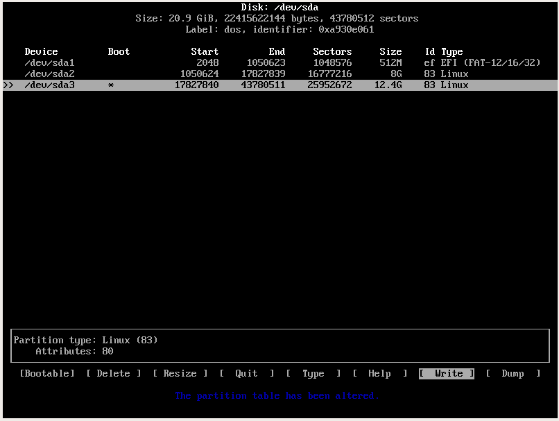

Installing ArchLinux on VB
==========================
  - Download the `archlinux-2017.03.01-dual.iso` (obviously most recent) from
    some [mirror](https://www.archlinux.org/download/).

VB specific config
------------------
  1. choose *Arch Linux 64 bit*
  2. choose whatever for memory (I originally used 8G)
  3. select *virtual hard disk* and *VDI*
    * again use whatever capacity you think you'll need
  4. Start the VB with the `.iso` you downloaded

Initial Setup of System
-----------------------
I tried using `parted` for this, but the commands are easy to mess up. I
switched to using `cfdisk`

  - Note: when partitioning via `cfdisk` I found that deleting current partitions wasn't being saved, the partitions still existed. I fixed this by
    using `cfdisk`. In my opinion, `cfdisk` is way easier than `parted`. The reason is that doing *start/end* with percentages gets weird when you add
    a swap into the mix

### Partitioning the disk (`cfdisk`)

  - **Note about UEFI** setup: you need another (small ~ 512MB) partition to
    hold the EFI(`esp`) System loader.

  1. Run `cfdisk /dev/sda`. Pick `gpt`. Note: `gpt` does not use/need boot
     flags.
  2. There is a decent tutorial [here](https://www.ostechnix.com/install-arch-linux-latest-version/).
     Basically just follow the steps in the gui.
     You're going to end up with 3 partitions:
    - EFI: `New -> 513M -> select primary -> write -> 'yes' (select EFI
      partition type)
    - Swap: `New -> 8G -> select primary -> write -> 'yes'
    - Root: `New -> remaining disk -> select primary -> make bootable -> write -> 'yes'`

### Partitioning the disk (`parted`)
```
parted /dev/sda
(parted) mklabel gpt
(parted) mkpart esp fat32 1MiB 513Mib
(parted) set 1 boot on
(parted) mkpart primary linux-swap 513MiB 8GiB
(parted) mkpart primary ext4 8GiB 100%
(parted) quit
```

### Formatting the file system
  - We are going to keep 1 partition for `/` and `/home/drew`.  The `/` is going to be the bootable & primary.
  - For the EFI System, it needs to be formatted as `FAT32`

```bash
mkfs.ext4 /dev/sda3      #this will be whatever your root partition is
mkfs.fat -F32 /dev/sda1
```

### Mounting and Swap
  - Set the swap directory
    - You may get output that says `no label`. This is normal

```bash
mkswap /dev/sda2
swapon /dev/sda2
```

  - You need to mount the root directory
  - Also you need the `/boot` directory for installing the EFI bootloader later

```bash
mount /dev/sda3 /mnt
mkdir -p /mnt/boot
mount /dev/sda1 /mnt/boot
```

Installing Arch on your filesystems that you created
---------------
The mirror could be really slow. You can edit `/etc/pacman.d/mirrorlist`.

```bash
pacstrap /mnt base base-devel
```

- You also need to create a *File System Table* or `fstab`. There is a pretty
  good quote about what this thing is:

>Fstab is configured to look for specific file systems and mount them
>automatically in a desired way each and every time, preventing a myriad of
>disasters from occurring.

```bash
genfstab -U /mnt >> /mnt/etc/fstab
```

Additional Steps
----------------
  1. Change root into the `/mnt` file system

```bash
arch-chroot /mnt /bin/bash
```

  2. Install vim `pacman -S vim`
  3. Set hostname with

```bash
echo <hostnameYouChoose> > /etc/hostname`
hostname -F /etc/hostname
```

- also you want to change the /etc/hosts to have

```
127.0.0.1  localhost.localdomain   localhost
::1        localhost.localdomain   localhost
127.0.1.1  myhostname.localdomain  myhostname
```

Locale
-------
  1. You actually need to do this, one reason is for i3 to function properly
  2. Go into /etc/locale.gen and uncomment `en_US.UTF-8 UTF-8`
  3. Generate the locales and set the LANG variable

```bash
locale-gen
touch /etc/locale.conf
echo "LANG=en_US.UTF-8" >> /etc/locale.conf
```

  4. Check that the language was set up correctly with `localectl`. This may
     fail. If it does, just check it later after you boot into your system.

BootLoader (2 options)
----------

### Option 1: `systemd-boot`

```
bootctl --path=/boot install
```

You need to copy and edit 2 files:
You'll also need the UUID of your **`root`** partition (This is required only for
your root partition, not esp)

```
cp /usr/share/systemd/bootctl/loader.conf /boot/loader/entries/
cp /usr/share/systemd/bootctl/arch.conf /boot/loader/entries/
blkid -s PARTUUID -o value /dev/sda3
```

First you want to edit `loader.conf` and have the following:

```
default  arch
timeout  4
editor   0
```

To make the next step easier:

```
echo `blkid -s PARTUUID -o value /dev/sda3` >> /boot/loader/entries/arch.conf
```

Next edit `arch.conf`:

```
title Arch Linux
linux /vmlinuz-linux
initrd /initramfs-linux.img
options root=PARTUUID=6b18a3fe-6311-4fa7-810a-effe98500 rw
```

Now run

```
bootctl update
```

If you're using a Dell XPS 13 (9360) - you need the `nvme` modules.

```
#/etc/mkinitcpio.conf

MODULES=(nvme)
```

Then run

```
mkinitcpio -p linux
```

### Option 2:  `grub`

**NOTE**: If you have a UEFI setup, you should use the UEFI options

### UEFI Added steps
  - you need to setup grub on the EFI system

  1. Now that you're `chroot`ed into `/mnt` install `grub` and `efibootmgr`

```bash
pacman -S grub efibootmgr
```

  2. Now install grub onto the EFI system with the following command. You have
     to mount /boot WHILE YOU'RE HERE.

```bash
mount /boot
grub-install --target=x86_64-efi --efi-directory=/boot --bootloader-id=grub
```

  3. Check that the main grub directory was installed in `/boot/grub` with `ls`
     or something
  4. Generate the grub configuration file and copy it to EFI dir from step 3

```bash
grub-mkconfig -o /boot/grub/grub.cfg
cp /boot/grub/grub.cfg /boot/EFI/grub
```
  
  5. There is a bug in the bootloader process, here is the wiki explanation on
     how to fix it (this worked for me)

>Unfortunately, the `grub.cfg` file that is created will not contain the proper
>UUID in order to boot, even if it reports no errors. see
>https://bbs.archlinux.org/viewtopic.php?pid=1294604#p1294604. In order to fix
>this issue the following commands:

```bash
mount /dev/sdxY /mnt        #Your root partition.
mount /dev/sdxZ /mnt/boot   #Your boot partition (if you have one).
arch-chroot /mnt
pacman -S linux
grub-mkconfig -o /boot/grub/grub.cfg
```

-----------------

  1. `pacman -S grub os-prober`
  2. `grub-install /dev/sda`
  3. `grub-mkconfig -o /boot/grub/grub.cfg`
    - This might throw up some nonsense about LVM. Ignore that.

Final
-----
Finally, exit from the chroot, unmount the partitions and reboot your Arch
Linux. Make sure you have removed the installation media too.

```bash
exit
umount -R /mnt
reboot
```
  - Select Existing OS

Part 2
======
  - Find your network interfaces via `ip addr` and initialize them with `dhccpd
    <interface>`
  - If you're running Arch inside VirtualBox, run the command `systemctl enable dhcpcd@enp0s3.service` 

  1. Once you get your networking shit together, update packages `pacman -Syyu`
  2. Enable multilib in `/etc/pacman.conf`
  3. You'll need to sync your packages with `pacman -Syy`
  4. Go into `/etc/pacman.d/mirrorlist` and move some of the United States
     mirrors to the top (Arch prioritizes mirrors from top>bottom)
  5. Install `zsh` (you're going to set it as the default shell for your user)
    - `pacman -S zsh`

### Creating a user
  - According to the wiki

>Do not worry about adding the user to other groups now. If later on you will
>install a particular application, or perform a specific configuration, that
>requires explicitly adding the user to a group, the wiki will remind you to do
>it in the specific article that you will be following.

  1. So we're going to add a user to the `wheel` group right now. Additionally, for
use with `xorg-server` we want the `video` and `audio` groups as well

```bash
useradd -m -G wheel,video,audio -s /bin/zsh drew
```
  2. If you mess it up, you can add the user to groups with `gpasswd`
```bash
gpasswd --add drew video
gpasswd --add drew audio
```
  3. Double check by running the command `groups`
  4. Make a password for your user `passwd drew`


#### Adding new user to `sudo`ers
  1. Install `sudo` with `pacman -S sudo`
  2. Add your user as to `sudo`ers
```bash
visudo
```
Find and uncomment the following lines:

```
 %wheel ALL=(ALL) ALL
 %wheel ALL=(ALL) NOPASSWD: ALL
```

  3. Set the root passwd with `passwd`

### Fullscreen in VirtualBox
You need the `virtualbox-guest-utils` on your arch instance to be able to go
*truly* fullscreen
  1. run `sudo pacman -S virtualbox-guest-utils` and when prompted get the
     `arch` option
  2. Your user should be in the `audio` and `video` groups (should have been
     completed when creating user)

### i3 and X
  1. Now you need X and i3

```bash
pacman -S xorg xorg-server xorg-xinit xterm i3
```
  - Just go with the default options
  2. Now add `exec i3` to `.xinitrc`
Note: you need to `logout` and log in as another user if you want them to be
able to run `startx`
  3. `logout` and log back in. NOTE: You cannot run startx unless you logged in as that user. So if you
     need to run `logout`, do that before startx. You'll need to do this if you
logged in as `root` and `su user` at any time.
  4. Now run `startx`. When in i3 type *MOD+ENTER*. Now to get it to fullscreen,
     check your display and use the command.
```bash
xrandr --listmonitors
xrandr --output VGA-1 --mode 1920x1080
```

Adding SSH for helpful debugging
===========================
  - Sometimes you'll need to kill processes, but your input is messed up on your
    VM. We're going to install `ssh` so that you can connect from the host and
kill stuff if needed. NOTE: you'll need to have a root and user password set to
be able to do this. Also you have to ssh as a user, can't ssh as root.
  1. On the guest (arch) instance.
```bash
sudo pacman -S openssh
systemctl enable sshd
systemctl start sshd
```

  2. On the VirtualBox settings.
    - Go to Machine -> Settings -> Network -> Port Forwarding
    - Click add a port
    - Ignore Name/Host IP/Guest IP
    - Protocol needs to be TCP
    - The host port needs to be greater than 1024, so for an example set
```bash
Protocol = TCP
Host Port = 2222
Guest Port = 22
```

  3. Connect from host
```bash
ssh -p 2222 username@localhost
```

  4. Just enter the password and you're in
